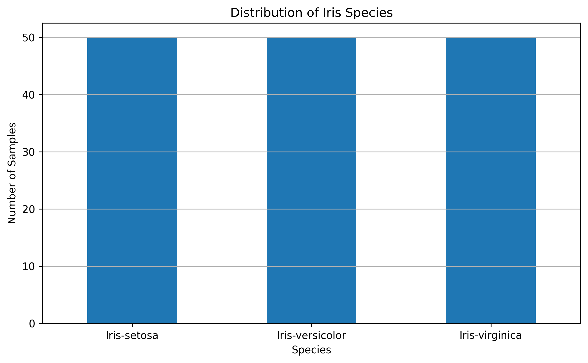
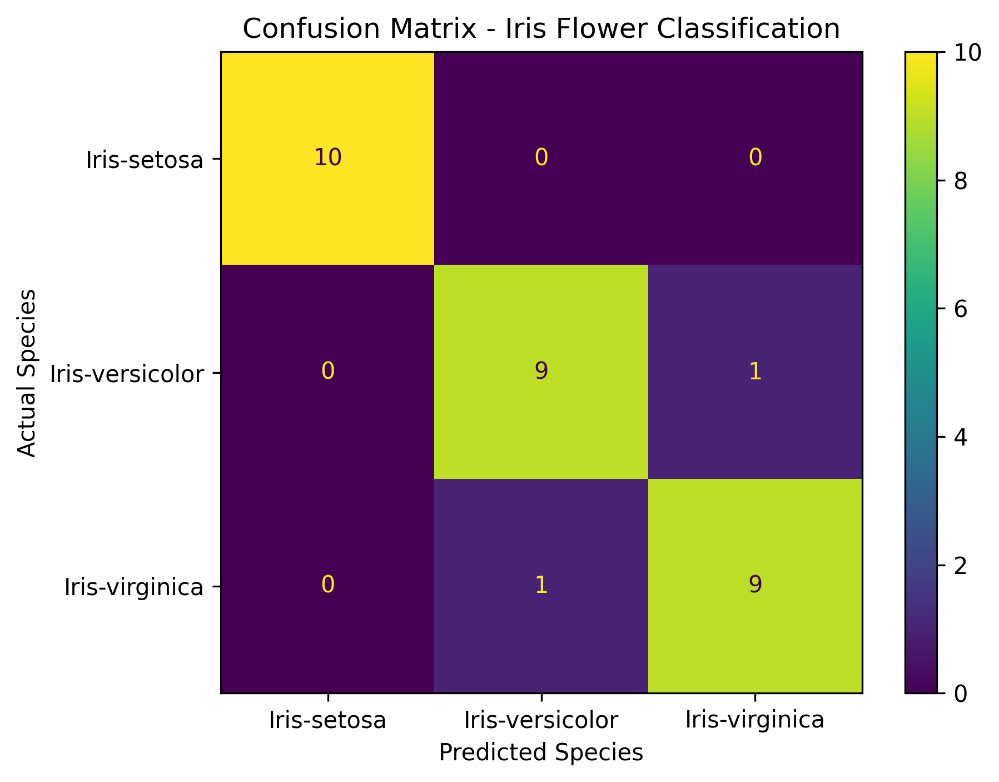

# Iris Flower Classification using Machine Learning

## Project Overview

This project was developed as **Task 1 of the CodeAlpha Data Science Internship**.

The objective is to build a machine learning classification model that can identify the species of an Iris flower based on its physical measurements.

The project classifies flowers into three species:

* **Iris-setosa**
* **Iris-versicolor**
* **Iris-virginica**

The classification is performed using four flower measurements:

* Sepal Length
* Sepal Width
* Petal Length
* Petal Width

The complete workflow covers dataset inspection, exploratory data analysis, visualization, preprocessing, model training, prediction, and performance evaluation.

---

## Objective

The main objectives of this project are:

* Use Iris flower measurements as input data.
* Build a machine learning classification model.
* Classify Iris flowers into Setosa, Versicolor, and Virginica.
* Evaluate the model using unseen test data.
* Measure classification performance using accuracy and detailed evaluation metrics.
* Understand the basic workflow of supervised multi-class classification.

---

## Dataset

The project uses the **Iris.csv** dataset provided for the CodeAlpha task.

### Dataset Characteristics

| Property          | Details |
| ----------------- | ------- |
| Total Samples     | 150     |
| Total Columns     | 6       |
| Input Features    | 4       |
| Target Variable   | Species |
| Number of Classes | 3       |
| Samples per Class | 50      |

### Features Used

| Feature         | Description                 |
| --------------- | --------------------------- |
| `SepalLengthCm` | Sepal length in centimeters |
| `SepalWidthCm`  | Sepal width in centimeters  |
| `PetalLengthCm` | Petal length in centimeters |
| `PetalWidthCm`  | Petal width in centimeters  |

The `Id` column is treated only as a record identifier and is **not used as a machine learning feature**.

---

## Data Verification

Before model development, the dataset was inspected to verify its quality and structure.

### Verification Results

* **Missing values:** 0
* **Duplicate rows:** 0
* **Class distribution:** Balanced
* **Iris-setosa:** 50 samples
* **Iris-versicolor:** 50 samples
* **Iris-virginica:** 50 samples

The dataset was therefore suitable for the classification workflow.

---

## Exploratory Data Analysis

Exploratory analysis was performed to understand the dataset before training the model.

The analysis included:

* Dataset structure inspection
* Data type verification
* Statistical summary
* Missing-value checking
* Duplicate-value checking
* Species distribution analysis
* Feature relationship visualization

### Species Distribution

The dataset contains an equal number of samples from each Iris species, with 50 observations per class.



### Petal Measurement Relationship

A scatter plot of petal length versus petal width was used to visualize the distribution of the three Iris species.

The visualization showed that **Iris-setosa is strongly separated**, while **Iris-versicolor and Iris-virginica show some overlap**.

---

## Machine Learning Workflow

The following workflow was implemented:

```text
Dataset Loading
      ↓
Data Inspection
      ↓
Data Quality Verification
      ↓
Exploratory Data Analysis
      ↓
Feature Selection
      ↓
Target Encoding
      ↓
Train-Test Split
      ↓
Feature Scaling
      ↓
Logistic Regression
      ↓
Prediction
      ↓
Model Evaluation
```

---

## Model Used

### Logistic Regression

A **Logistic Regression** classifier was used for the multi-class classification task.

The model was trained using the four Iris flower measurements.

### Train-Test Split

The dataset was divided into:

* **80% training data:** 120 samples
* **20% testing data:** 30 samples

Stratified splitting was used to maintain the class distribution between the training and testing sets.

### Feature Scaling

`StandardScaler` was used to standardize the input features before training the Logistic Regression model.

---

## Model Evaluation

The trained model was evaluated using the unseen test dataset.

### Accuracy

**93.33%**

The model correctly classified:

**28 out of 30 test samples.**

### Classification Report

| Species         | Precision |   Recall | F1-Score |
| --------------- | --------: | -------: | -------: |
| Iris-setosa     |      1.00 |     1.00 |     1.00 |
| Iris-versicolor |      0.90 |     0.90 |     0.90 |
| Iris-virginica  |      0.90 |     0.90 |     0.90 |
| **Overall**     |  **0.93** | **0.93** | **0.93** |

---

##  Confusion Matrix

The confusion matrix was used to examine the model's classification performance for each species.

```text
                 Predicted
              Setosa  Versicolor  Virginica

Actual Setosa      10       0          0
       Versicolor   0       9          1
       Virginica    0       1          9
```



### Interpretation

* **Iris-setosa:** 10/10 samples correctly classified.
* **Iris-versicolor:** 9/10 samples correctly classified.
* **Iris-virginica:** 9/10 samples correctly classified.
* One Versicolor sample was classified as Virginica.
* One Virginica sample was classified as Versicolor.

The errors occurred only between **Versicolor and Virginica**, which is consistent with the overlap observed during exploratory visualization.

---

## Key Findings

1. The dataset contains **150 samples across three balanced classes**.
2. No missing values or duplicate rows were found during data verification.
3. Petal measurements provide useful separation between the Iris species.
4. **Iris-setosa was classified perfectly** by the model.
5. The only classification errors occurred between **Iris-versicolor and Iris-virginica**.
6. The Logistic Regression model achieved a **93.33% test accuracy**.
7. The model demonstrated strong overall performance for the Iris multi-class classification problem.

---

## Technologies & Libraries

* **Python**
* **Pandas** — Data loading and manipulation
* **NumPy** — Numerical operations
* **Matplotlib** — Data visualization
* **Scikit-learn** — Preprocessing, model training, and evaluation
* **Google Colab** — Development environment

---

##  Project Structure

```text
CodeAlpha_Iris_Flower_Classification/
│
├── data/
│   └── Iris.csv
│
├── notebook/
│   └── CodeAlpha_Task1_Iris_Flower_Classification.ipynb
│
├── visualizations/
│   ├── species_distribution.png
│   └── confusion_matrix.png
│
├── README.md
├── requirements.txt
└── .gitignore
```

---

## How to Run

### 1. Clone the repository

```bash
git clone https://github.com/YOUR-USERNAME/CodeAlpha_Iris_Flower_Classification.git
```

### 2. Navigate to the project

```bash
cd CodeAlpha_Iris_Flower_Classification
```

### 3. Install dependencies

```bash
pip install -r requirements.txt
```

### 4. Open the notebook

Open:

```text
notebook/CodeAlpha_Task1_Iris_Flower_Classification.ipynb
```

The notebook can be executed using **Google Colab** or a compatible Jupyter environment.


## CodeAlpha Task Requirement Coverage

| CodeAlpha Requirement              | Implementation                                                      |
| ---------------------------------- | ------------------------------------------------------------------- |
| Use Iris flower measurements       | Four sepal and petal measurements used                              |
| Classify Iris species              | Setosa, Versicolor, and Virginica classified                        |
| Use Scikit-learn                   | Scikit-learn used for preprocessing, model training, and evaluation |
| Evaluate accuracy and performance  | Accuracy, precision, recall, F1-score, and confusion matrix used    |
| Understand classification concepts | Complete supervised multi-class classification workflow implemented |


## Conclusion

This project successfully demonstrates the use of supervised machine learning for Iris flower classification.

A Logistic Regression model was trained using four flower measurements and evaluated on unseen test data. The model achieved a **93.33% accuracy**, correctly classifying 28 of 30 test samples.

The evaluation showed perfect classification for Iris-setosa, while the remaining errors occurred between Iris-versicolor and Iris-virginica. Overall, the project demonstrates how flower measurements can be used effectively to distinguish between different Iris species.


## Internship

**CodeAlpha Data Science Internship**

**Task:** Task 1 — Iris Flower Classification

**Domain:** Data Science


## Project Status

**Completed**

This repository contains the complete source notebook, dataset, visualizations, documentation, and dependency information for the CodeAlpha Task 1 submission.
